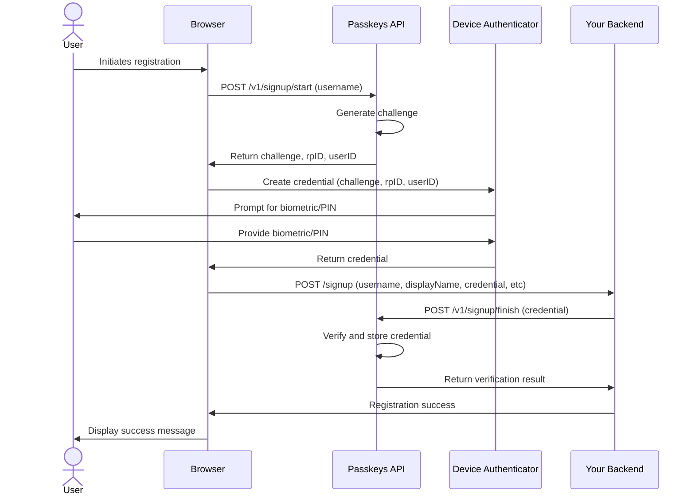
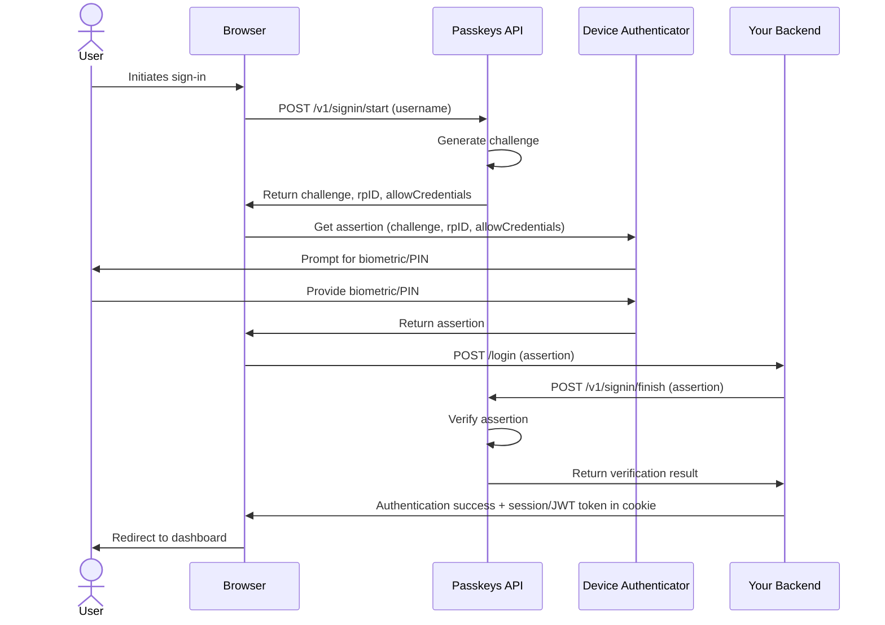

<a id="readme-top"></a>

<!-- PROJECT SHIELDS -->
<!--
*** I'm using markdown "reference style" links for readability.
*** Reference links are enclosed in brackets [ ] instead of parentheses ( ).
*** See the bottom of this document for the declaration of the reference variables
*** for contributors-url, forks-url, etc. This is an optional, concise syntax you may use.
*** https://www.markdownguide.org/basic-syntax/#reference-style-links
-->
[![Contributors][contributors-shield]][contributors-url]
[![Stargazers][stars-shield]][stars-url]
[![Issues][issues-shield]][issues-url]
[![Apache License 2.0][license-shield]][license-url]


<!-- PROJECT LOGO -->
<br />
<div align="center">
  <a href="https://github.com/helioauth/passkeys-api">
    
  </a>

<h3 align="center">HelioAuth Passkeys API</h3>

  <p align="center">
    A passwordless authentication solution for modern and traditional web applications 
    <br />
    <a href="https://github.com/helioauth/passkeys-api"><strong>Explore the docs »</strong></a>
    <br />
    <br />
    <a href="https://demo.usepasskeys.dev/">View Demo</a>
    ·
    <a href="https://github.com/helioauth/passkeys-api/issues/new?labels=bug&template=bug-report---.md">Report Bug</a>
    ·
    <a href="https://github.com/helioauth/passkeys-api/issues/new?labels=enhancement&template=feature-request---.md">Request Feature</a>
  </p>
</div>


<!-- TABLE OF CONTENTS -->
<details>
  <summary>Table of Contents</summary>
  <ol>
    <li>
      <a href="#about-the-project">About The Project</a>
      <ul>
        <li><a href="#built-with">Built With</a></li>
      </ul>
    </li>
    <li>
      <a href="#getting-started">Getting Started</a>
      <ul>
        <li><a href="#prerequisites">Prerequisites</a></li>
        <li><a href="#installation">Installation</a></li>
      </ul>
    </li>
    <li><a href="#usage">Usage</a></li>
    <li><a href="#roadmap">Roadmap</a></li>
    <li><a href="#contributing">Contributing</a></li>
    <li><a href="#license">License</a></li>
    <li><a href="#contact">Contact</a></li>
    <li><a href="#acknowledgments">Acknowledgments</a></li>
  </ol>
</details>


<!-- ABOUT THE PROJECT -->
## About The Project

A well-documented REST API that helps developers implement WebAuthn in their web applications faster.


### Built With

 [![Spring Boot][Spring-Boot]][Spring-Boot-url]


<!-- GETTING STARTED -->
## Getting Started

To get a local copy up and running, follow these simple steps.

### Prerequisites

 * Java 22
 * Maven
 * Docker (or similar) for a local PostgreSQL instance

### Installation


1. Clone the repo
   ```sh
   git clone https://github.com/helioauth/passkeys-api.git
   ```
2. Install dependencies
   ```sh
    cd passkeys-api-demo
    ./mvnw install
   ```
3. Start PostgreSQL server

   ```bash
    docker-compose up -d
   ```

4. Start the application in development mode
   ```sh
    ./mvnw spring-boot:run -Dspring-boot.run.profiles=dev
   ```

<p align="right">(<a href="#readme-top">back to top</a>)</p>


<!-- USAGE EXAMPLES -->
## Usage

The Passkeys API handles all WebAuthn related actions like issuing challenges,
verifying signatures, and storing public keys.
Your frontend app should request a challenge from the API, pass it to the browser, then return the result.

### Sign-up flow



### Sign-in flow



_For more examples, please refer to the [Demo](https://github.com/helioauth/passkeys-api-demo)_

<p align="right">(<a href="#readme-top">back to top</a>)</p>


<!-- ROADMAP -->
## Roadmap

- [x] Sign-up and sign-in with passkeys
- [ ] Support for more than one passkey per user
- [ ] Backup authentication method via magic links, OTP or other
- [ ] Administration endpoints for user and credential management
- [ ] Support applications that don't have a backend. Generate JWT with custom fields.

See the [open issues](https://github.com/helioauth/passkeys-api/issues) for a full list of proposed features (and known issues).

<p align="right">(<a href="#readme-top">back to top</a>)</p>


<!-- CONTRIBUTING -->
## Contributing

Contributions are what make the open source community such an amazing place to learn, inspire, and create. Any contributions you make are **greatly appreciated**.

If you have a suggestion that would make this better, please fork the repo and create a pull request.
You can also open an issue with the tag "enhancement". Remember to give the project a star! Thanks again!

1. Fork the Project
2. Create your Feature Branch (`git checkout -b feature/AmazingFeature`)
3. Commit your Changes (`git commit -m 'Add some AmazingFeature'`)
4. Push to the Branch (`git push origin feature/AmazingFeature`)
5. Open a Pull Request

<p align="right">(<a href="#readme-top">back to top</a>)</p>

### Top contributors:

<a href="https://github.com/helioauth/passkeys-api/graphs/contributors">
  
</a>


<!-- LICENSE -->
## License

Distributed under the Apache License 2.0. See `LICENSE` for more information.

<p align="right">(<a href="#readme-top">back to top</a>)</p>


<!-- CONTACT -->
## Contact

HelioAuth: [https://helioauth.com/](https://helioauth.com/)

Project Link: [https://github.com/helioauth/passkeys-api](https://github.com/helioauth/passkeys-api)

<p align="right">(<a href="#readme-top">back to top</a>)</p>


<!-- ACKNOWLEDGMENTS -->
## Acknowledgments

* [java-webauthn-server by Yubico](https://github.com/Yubico/java-webauthn-server)

<p align="right">(<a href="#readme-top">back to top</a>)</p>


<!-- MARKDOWN LINKS & IMAGES -->
<!-- https://www.markdownguide.org/basic-syntax/#reference-style-links -->
[contributors-shield]: https://img.shields.io/github/contributors/helioauth/passkeys-api.svg?style=for-the-badge
[contributors-url]: https://github.com/helioauth/passkeys-api/graphs/contributors
[stars-shield]: https://img.shields.io/github/stars/helioauth/passkeys-api.svg?style=for-the-badge
[stars-url]: https://github.com/helioauth/passkeys-api/stargazers
[issues-shield]: https://img.shields.io/github/issues/helioauth/passkeys-api.svg?style=for-the-badge
[issues-url]: https://github.com/helioauth/passkeys-api/issues
[license-shield]: https://img.shields.io/github/license/helioauth/passkeys-api.svg?style=for-the-badge
[license-url]: https://github.com/helioauth/passkeys-api/blob/master/LICENSE
[Spring-Boot]: https://img.shields.io/badge/Spring-Boot-6DB33F?style=for-the-badge&logo=spring&logoColor=6DB33F
[Spring-Boot-url]: https://spring.io/projects/spring-boot
